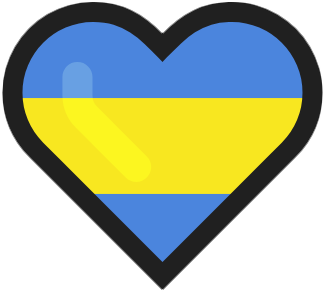

    

# Proyecto Personal | [**Tinder Swipe**](https://tinder-swipe-insa.vercel.app/)

  

## **📌 TECNOLOGÍAS UTILIZADAS**

---

## **📋 DESCRIPCIÓN**

 

Una aplicación web interactiva que simula la funcionalidad de deslizar perfiles, inspirada en la popular aplicación Tinder. Los usuarios pueden deslizar las tarjetas hacia la derecha o hacia la izquierda para indicar si les gusta o no un perfil. También se incluyen botones interactivos para simular estas acciones de deslizamiento.

 

---

## **⚠️ IMPORTANTE!**

 

Abriendo el archivo **`index.html`** con las extensiones [Live Server](vscode:extension/ritwickdey.LiveServer), [Live Preview](vscode:extension/ms-vscode.live-server) o cualquiera de tu preferencia, podrás ejecutar el proyecto en tiempo real.

 

---

## **📁 DETALLE**

 

La aplicación está construida con HTML, CSS y JavaScript, y cuenta con:

**📍 TARJETAS DE PERFIL |**

- Tarjetas interactivas con imágenes de perfiles y botones de "LIKE" y "NOPE".
- Funcionalidad de deslizamiento y animaciones suaves para una experiencia de usuario agradable.
- Botones adicionales en el pie de página para simular acciones de deslizamiento.

 

---

 

Hecho con  por [**DIEGO INSAURRALDE**](https://insaurralde.vercel.app/) 

